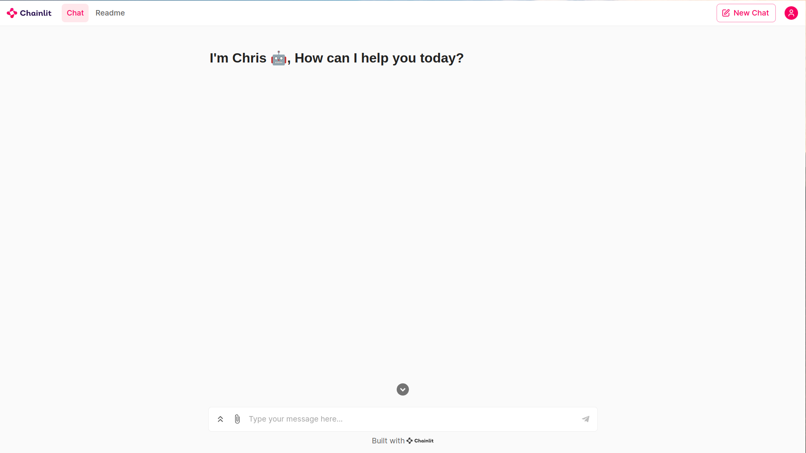
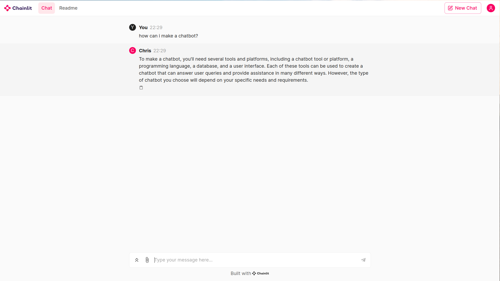

### G-BOT: AI-Powered Chatbot






## Overview
G-BOT is an advanced chatbot created using the Langchain framework, powered by the cutting-edge Hugging Face model tiiuae/falcon-7b-instruct. This chatbot aims to provide intuitive and engaging conversations on a wide range of topics, enhancing user interaction and experience. With the integration of Chainlit for UI, G-BOT offers a seamless interface for users to interact with.

## Features
- **Hugging Face Model**: Utilizes the tiiuae/falcon-7b-instruct model for natural language understanding and generation.
- **Langchain Framework**: Provides a robust architecture for building conversational AI systems.
- **Chainlit UI**: Offers a user-friendly interface for interacting with G-BOT.
- **Versatile Conversations**: Capable of engaging users in diverse conversations ranging from general knowledge to specific domains.
- **Customizable**: Easily adaptable to specific use cases or industries by fine-tuning the model or integrating additional functionalities.
- **Scalable**: Designed to handle large volumes of interactions and users.

## Setup Instructions
To deploy G-BOT on your system, follow these steps:

1. **Clone the Repository**: Clone the G-BOT repository from GitHub using the following command:
    ```bash
    git clone https://github.com/your-username/G-BOT.git
    ```

2. **Install Dependencies**: Navigate to the project directory and install the necessary dependencies:
    ```bash
    cd G-BOT
    pip install -r requirements.txt
    ```

3. **Configure Hugging Face Model**: Set up the Hugging Face model by providing your API key or downloading the model weights locally. Follow the instructions provided by Hugging Face for model configuration.

4. **Run G-BOT**: Execute the following command to start G-BOT:
    ```bash
    python main.py
    ```

5. **Interact with G-BOT**: Once the application is running, open your web browser and navigate to the provided URL to start interacting with G-BOT through the Chainlit UI.

## Usage
G-BOT provides a good conversational experience. Users can initiate conversations by typing messages into the input field provided by the Chainlit UI. G-BOT will respond with appropriate replies generated by the underlying Hugging Face model.

## Contributing
Contributions to G-BOT are welcome! Whether you want to improve the conversational capabilities, enhance the UI, or add new features, feel free to fork the repository and submit pull requests.

## Acknowledgments
- The Langchain framework developers for providing a powerful platform for building conversational AI systems.
- Hugging Face for their state-of-the-art natural language processing models.
- Chainlit for offering a user-friendly UI solution for chatbot interfaces.

## Support
For any inquiries or issues, please contact [sibims00@example.com](mailto:sibims00@example.com).

Thank you for using G-BOT! We hope you enjoy your conversational experience with our AI-powered chatbot.
